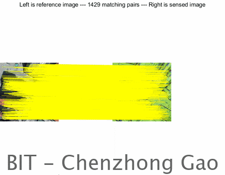
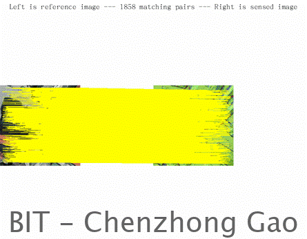
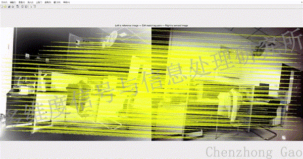
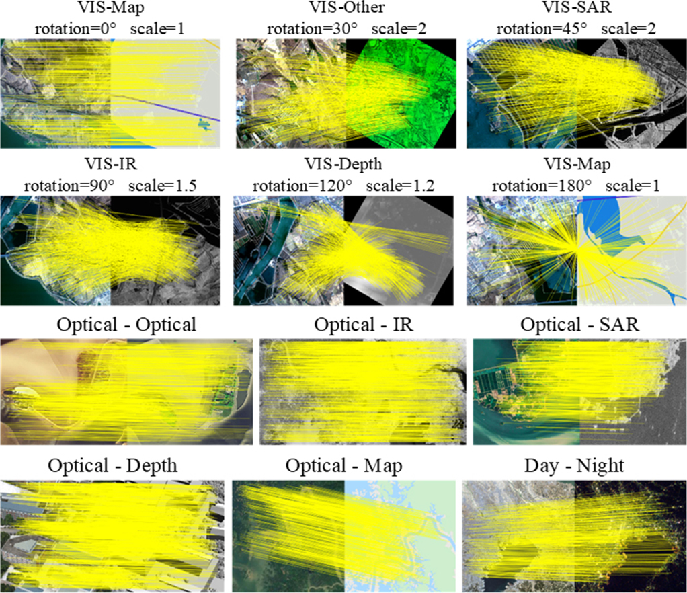

# HOMO-Feature: Cross-Arbitrary-Modal Image Matching with Homomorphism of Organized Major Orientation

<p align="center">
  
</p>

Paper Link: https://openaccess.thecvf.com/content/ICCV2025/html/Gao_HOMO-Feature_Cross-Arbitrary-Modal_Image_Matching_with_Homomorphism_of_Organized_Major_Orientation_ICCV_2025_paper.html

*The authors are busy job hunting for now, causing a delay of codes working. The algorithm and datasets will be fully open-source very soon.*

A new image matching method of traditional handcrafted framework with the following effects: (2024.09.10)
<table>
  <tr>
    <td align="center">One-stage</td>
    <td align="center">Two-stage</td>
  </tr>
  <tr>
    <td align="center">
      
    </td>
    <td align="center">
      
    </td>
  </tr>
</table>

<p align="center">
<table>
  <tr>
    <td align="center">Multi-camera</td>
  </tr>
  <tr>
    <td align="center">
      
    </td>
  </tr>
</table>
</p>

<!--
<table>
  <tr>
    <td align="center">
      
    </td>
    <td align="center">
      
    </td>
  </tr>
</table>
-->

## Presentation Poster
<p align="center">
  
</p>


## 📦 Datasets Release
*** GCZ dataset ***

Google Drive: https://drive.google.com/file/d/1HpxE8mEYIt_VH7WWkuVYaGnVw4Uh2Hoz/view?usp=drive_link

Baidu Netdisk: https://pan.baidu.com/s/1yrVsClR9Of1ze0WkPHYJiA?pwd=homo

*** Revised MRSI dataset labels ***

Google Drive: https://drive.google.com/file/d/1nMq6tzprdqRtsCc-rUwOeiMbxukTrgpU/view?usp=drive_link

Baidu Netdisk: https://pan.baidu.com/s/1FXuk3oUw5ItLnjSYGopkxA?pwd=mrsi


## 📚 Citation
If you find our work useful in your research, please consider citing:
```bibtex
@InProceedings{Gao_2025_ICCV,
    author    = {Gao, Chenzhong and Li, Wei and Weng, Desheng},
    title     = {{HOMO-Feature}: Cross-Arbitrary-Modal Image Matching with Homomorphism of Organized Major Orientation},
    booktitle = {Proceedings of the IEEE/CVF International Conference on Computer Vision (ICCV)},
    pages     = {10538-10548},
    year      = {2025}
}
